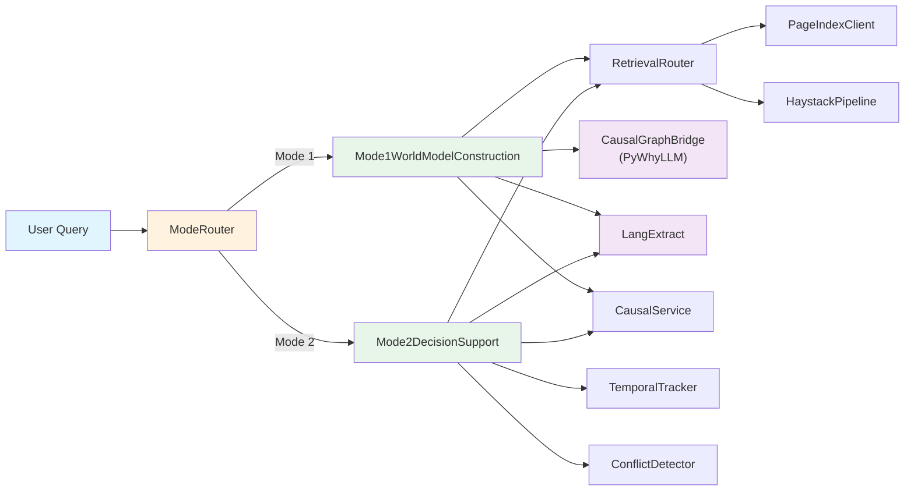

# Causeway Codebase Audit Report

**Date:** 2026-02-15  
**Scope:** Full codebase analysis against target causal-agentic architecture  
**Status:** Draft v1.0  

---

## Executive Summary

The Causeway codebase demonstrates **strong architectural alignment** with the target causal-agentic design. All four architectural pillars — Discovery/PyWhyLLM, World Model/Indexing, Inference/Evidence, and LangExtract — have concrete implementations. The two operating modes (World Model Construction and Decision Support) are fully scaffolded with well-defined stage progressions, audit trails, and a human review gate.

**Overall alignment: ~75%** — The skeleton and integration contracts are solid, but several components operate in a degraded "mock mode" when external infrastructure is absent, and there is no single end-to-end orchestration entrypoint that seamlessly chains all four pillars together.

### Key Strengths

| Area | Details |
|------|---------|
| **PyWhyLLM Bridge** | Fully integrated via `CausalGraphBridge` using Gemini's OpenAI-compatible endpoint |
| **LangExtract** | Deeply embedded in Mode 1 and Mode 2 for structured variable/edge/query extraction |
| **PageIndex + Haystack Router** | Dual retrieval with automatic strategy selection, hybrid BM25+vector fusion, re-ranking |
| **Pydantic Models** | Strong type system across `EvidenceBundle`, `WorldModelVersion`, `CausalEdge` etc. |
| **Conflict Detection** | Sophisticated edge contradiction, direction reversal, and staleness detection |
| **Temporal Tracking** | Exponential confidence decay, per-edge validation timestamps, staleness reports |
| **Training Infrastructure** | Span collector, reward functions, trajectory storage — ready for Agent Lightning |

### Critical Gaps

| Area | Severity | Details |
|------|----------|---------|
| **No unified agent loop** | 🔴 Critical | Orchestrator exists but doesn't chain Mode Router → Mode 1/2 → Tool calls → LangExtract as a single agentic loop |
| **Mock mode prevalence** | 🟡 Moderate | PageIndex, Haystack, PyWhyLLM all silently fall back to mock mode; no alert or degradation signal |
| **Agent Lightning not wired** | 🟡 Moderate | Spans/rewards are defined but never consumed by an actual training loop |
| **LLM classification stub** | 🟡 Moderate | `ModeRouter.classify_with_llm()` is a placeholder returning a hardcoded response |
| **Missing external validation** | 🟠 Low | Optional DoWhy/causal-learn validation path is mentioned in systemdoc but unimplemented |

---

## Component Breakdown

### Pillar 1: Discovery Mode (Causal Reasoning via PyWhyLLM)

**Target:** LLM uses `pywhyllm` to reason in causal chains, discover relationships, and build understanding.

#### What Is Implemented

- **`src/causal/pywhyllm_bridge.py`** — `CausalGraphBridge` class (477 lines)
  - Initializes `pywhyllm.SimpleModelSuggester` backed by Gemini via Google's OpenAI-compatible endpoint (`generativelanguage.googleapis.com/v1beta/openai`)
  - `build_graph_from_evidence()` — For each variable pair, queries PyWhyLLM for pairwise causal direction, then grounds proposals in retrieved evidence
  - `classify_variable_roles()` — Infers treatment/outcome/confounder/mediator roles from DAG structure
  - `suggest_missing_confounders()` — Identifies unmeasured confounders between treatment–outcome pairs
  - `classify_edge_strength()` — Maps supporting/contradicting evidence counts → `STRONG`/`MODERATE`/`HYPOTHESIS`/`CONTESTED`
  - `extract_mechanism_from_evidence()` — Builds mechanism descriptions with document citations
  - `_ground_edge_in_evidence()` — Links each proposed edge to `EvidenceBundle`s by text matching
  - **Mock mode**: Falls back gracefully when no API key is present, producing deterministic sequential edges

- **`src/causal/dag_engine.py`** — NetworkX-backed DAG engine (401 lines)
  - Add/remove nodes and edges with automatic cycle detection (`_would_create_cycle()`)
  - `validate()` — Structural checks (DAG validity, orphan nodes, disconnected components, evidence refs)
  - Serialization to/from `WorldModelVersion` (Pydantic model)

- **`src/causal/service.py`** — `CausalService` (621 lines)
  - Facade over `DAGEngine` and `CausalPathFinder` — domain-level world model CRUD
  - `analyze_relationship()`, `trace_causal_path()`, `identify_confounders()`
  - `export_world_model()` / `import_world_model()` — version management
  - `detect_conflicts()` / `resolve_conflicts()` / `apply_resolutions()` — Phase 3 integration
  - Persistence to PostgreSQL via `DatabaseService`

- **`src/causal/path_finder.py`** — `CausalPathFinder` (8.6KB)
  - All-paths traversal between source and target variables
  - Confounder/mediator identification by graph topology
  - Path strength computation from edge metadata

- **`src/causal/conflict_resolver.py`** — Phase 3 conflict detection (733 lines)
  - `ConflictDetector`: edge contradiction, direction reversal, strength upgrades/downgrades, missing variables, stale evidence
  - `ConflictResolver`: evidence-weighted, temporal, source-priority, and manual resolution strategies
  - `apply_resolutions()` — applies changes back to the DAG engine

- **`src/causal/temporal.py`** — Phase 4 temporal tracking (382 lines)
  - `TemporalTracker`: per-edge timestamps, exponential confidence decay, staleness reports
  - Configurable thresholds for staleness, decay half-life, re-validation windows

#### Gaps & Recommendations

| Gap | Priority | Recommendation |
|-----|----------|----------------|
| **PyWhyLLM mock silently activates** | 🟡 High | Add a startup health check that logs a loud `WARNING` when mock mode is active. Expose `is_mock_mode()` status in the `/status` API endpoint |
| **No DoWhy/causal-learn integration** | 🟠 Medium | The systemdoc describes optional statistical validation; consider adding a thin `DoWhyValidator` class that runs backdoor-criterion checks when data is available |
| **Pairwise queries are O(n²)** | 🟠 Medium | For large variable sets, the bridge's pairwise approach scales poorly. Consider batching variable pairs or using PyWhyLLM's DAG suggestion API directly |
| **`guidance` monkeypatch** | 🟡 High | The bridge patches `guidance.llms.OpenAI.simple_chat_completion` — this couples tightly to `guidance` internals and will break on upstream updates. Document this fragility and pin the `guidance` version |

---

### Pillar 2: Data Indexing & World Model Construction

**Target:** Data is indexed into a page index using a hierarchical tree-based structure; LLM uses this to construct an internal "world model" for complex reasoning.

#### What Is Implemented

- **`src/pageindex/client.py`** — `PageIndexClient` (371 lines)
  - HTTP client for the PageIndex MCP server (`VectifyAI/pageindex-mcp`)
  - `register_document()` — uploads docs for tree indexing
  - `list_sections()` — returns hierarchical section tree
  - `read_section()` / `read_page()` — navigates to precise content
  - `search()` — full-text search within a document
  - Full mock mode with representative sample data

- **`src/pageindex/service.py`** — `PageIndexService` (7.1KB)
  - Higher-level wrapper converting PageIndex results → canonical `EvidenceBundle` format
  - Provenance tracking: section name, page number, section hierarchy, retrieval path

- **`src/haystack_svc/pipeline.py`** — `HaystackPipeline` (824 lines)
  - Haystack 2.x integration with Qdrant vector store
  - `add_document()` — sentence-aware splitting via `DocumentSplitter`, embedding via `SentenceTransformersDocumentEmbedder`
  - `search()` — vector similarity search with `SentenceTransformersTextEmbedder` → `QdrantEmbeddingRetriever`
  - `hybrid_search()` — BM25 + vector RRF fusion (Phase 2)
  - `rerank()` — heuristic relevance re-ranking (term coverage, density, proximity)
  - `_bm25_search()` — Okapi BM25 scoring with IDF weighting (520 lines of pure implementation)
  - Mock mode with JSON persistence (`.mock_chunks.json`)

- **`src/haystack_svc/service.py`** — `HaystackService` (428 lines)
  - `retrieve_evidence()` — semantic search → `EvidenceBundle`s
  - `retrieve_hybrid()` — BM25+vector with optional re-ranking
  - `retrieve_for_hypothesis()` — generates supporting AND refuting queries, classifies overall strength
  - `check_evidence_sufficiency()` — threshold-based sufficiency checks

- **`src/retrieval/router.py`** — `RetrievalRouter` (397 lines)
  - Strategy selection logic: `PAGEINDEX_ONLY`, `HAYSTACK_ONLY`, `HYBRID`, `BOTH_MERGE`, `AUTO`
  - Auto routing: uses PageIndex when `doc_ids` specified + provenance required, Haystack otherwise
  - `ingest_document()` — parallel ingestion into both systems
  - `retrieve_for_hypothesis()` / `check_evidence_sufficiency()` — Phase 2 hypothesis-aware retrieval

- **World Model Construction** — `src/modes/mode1.py` (882 lines)
  - Full 5-stage workflow: Variable Discovery → Evidence Gathering → DAG Drafting → Evidence Triangulation → Human Review
  - Uses hybrid retrieval (Phase 2) for all evidence gathering
  - Integrated PyWhyLLM bridge + LangExtract for two-stage DAG construction
  - Automatic conflict detection post-build (Phase 3)
  - Model persistence to PostgreSQL, human approval workflow
  - Fuzzy variable ID matching for LLM-generated references

- **Data Models** — `src/models/`
  - `WorldModelVersion` — versioned domain model with DAG JSON, variables, edges, approval metadata
  - `EvidenceBundle` — canonical evidence with `SourceReference`, `LocationMetadata`, `RetrievalTrace`, content hashing
  - `VariableDefinition`, `CausalEdge`, `EdgeMetadata`, `CausalPath` — full causal graph schema
  - Comprehensive `enums.py` — coverage of all status/type/role/strength classifications

- **Storage Layer** — `src/storage/`
  - `database.py` (15.5KB) — PostgreSQL async (SQLAlchemy + asyncpg) with full CRUD for documents, evidence, world models, audit entries
  - `object_store.py` (8.9KB) — MinIO/S3 integration for binary document storage
  - `redis_cache.py` (6.3KB) — Redis caching for evidence lookups and world model summaries

#### Gaps & Recommendations

| Gap | Priority | Recommendation |
|-----|----------|----------------|
| **Tree navigation is not LLM-directed** | 🔴 High | The target architecture envisions the LLM _navigating_ the PageIndex tree interactively ("what sections exist?" → "read section X"). Currently, `PageIndexClient` is called programmatically by the retrieval router, not by the LLM as a tool. Wire `list_sections()` and `read_section()` as callable tools in the orchestrator |
| **World model is flat-persisted** | 🟡 Medium | Models are serialized as JSON blobs to PostgreSQL. Consider a graph-native store or at minimum a proper nodes/edges table for querying |
| **No incremental model updates** | 🟡 Medium | Mode 1 always builds from scratch. Add `update_world_model()` that merges new evidence/variables into an existing model |
| **Mock mode for both retrieval backends** | 🟡 Medium | Both PageIndex and Haystack have mock modes that activate silently. The system should surface a clear degradation status to the user and API consumers |

---

### Pillar 3: Inference & Decision Support

**Target:** During inference, the LLM uses tool-calling to fetch external resources and leverages the world model for decisions. Every decision must be paired with underlying evidence.

#### What Is Implemented

- **`src/modes/mode2.py`** — `Mode2DecisionSupport` (601 lines)
  - 7-stage pipeline: Query Parsing → Model Retrieval → Staleness Check → Evidence Refresh → Conflict Detection → Causal Reasoning → Recommendation Synthesis
  - `_parse_query()` — Uses **LangExtract** to extract `domain`, `intervention`, `target_outcome`, `constraints` from natural language
  - `_refresh_evidence()` — Hybrid retrieval for recent evidence (Phase 2)
  - `_perform_causal_reasoning()` — Traces causal paths, identifies confounders/mediators, classifies effect types
  - `_synthesize_recommendation()` — Uses **LangExtract** to extract grounded recommendations with explicit evidence citations
  - Staleness checking via `TemporalTracker` with confidence decay (Phase 4)
  - Conflict detection on fresh evidence vs existing model (Phase 3)
  - Escalation logic: triggers Mode 1 update when model is stale, has critical conflicts, or variables are missing

- **`src/agent/orchestrator.py`** — `AgentOrchestrator` (406 lines)
  - Multi-step tool calling with LLM-in-the-loop
  - Default tools: `search_evidence`, `analyze_causal_path`, `get_model_summary`, `find_confounders`
  - `register_tool()` — extensible tool registration with `ToolDefinition` + handler callback
  - Span instrumentation for every LLM call and tool execution
  - Error handling with retry/recovery

- **`src/agent/llm_client.py`** — `LLMClient` (444 lines)
  - Google Gemini API wrapper (gemini-2.5-flash / gemini-2.5-pro)
  - `generate_with_tools()` — native Gemini function calling via `FunctionDeclaration`
  - `generate_structured()` — JSON output parsing against Pydantic schemas
  - Retry with exponential backoff, daily-quota detection, rate-limit delay extraction
  - JSON repair for malformed outputs

- **`src/agent/context_manager.py`** — Conversation context management (7.8KB)
  - Message history management with role tracking
  - Context window handling

- **`src/models/decision.py`** — Decision models (4.5KB)
  - `DecisionQuery` — structured query with objective, levers, constraints
  - `DecisionRecommendation` — recommendation with confidence level, evidence refs, risks, next steps

- **`src/models/audit.py`** — Audit models (2.7KB)
  - `AuditEntry` — timestamped entries linking mode, trace_id, inputs, reasoning steps, outputs

#### Gaps & Recommendations

| Gap | Priority | Recommendation |
|-----|----------|----------------|
| **Evidence → Decision linkage is textual** | 🟡 High | Recommendations reference evidence via text descriptions, not structured `bundle_id` backlinks. Add explicit `evidence_refs: list[UUID]` to every decision point |
| **No agentic tool loop in Mode 2** | 🔴 High | Mode 2 follows a fixed pipeline. The target architecture envisions the LLM deciding which tools to call based on reasoning. Mode 2 should use `AgentOrchestrator.run()` with tools for evidence refresh, model retrieval, and causal analysis rather than hardcoded sequential calls |
| **Missing "reasoning trace" in output** | 🟡 Medium | `DecisionRecommendation` has `reasoning_trace: str` but it's populated by string concatenation, not a structured chain. Add a `CausalReasoningTrace` model with explicit step-by-step evidence→conclusion links |
| **Orchestrator doesn't invoke Mode 1/2** | 🔴 High | The `AgentOrchestrator` and `Mode1WorldModelConstruction`/`Mode2DecisionSupport` are disconnected. Build a top-level `CausewayAgent` that: (1) uses `ModeRouter` to classify, (2) delegates to Mode 1/2, (3) wraps in span collection, (4) returns structured results with audit trail |

---

### Pillar 4: Regex & Entity Extraction (LangExtract)

**Target:** For regular expressions and targeted extraction, the system must integrate Google's `langextract`.

#### What Is Implemented

- **`langextract` is a declared dependency** in `pyproject.toml` (`langextract>=1.1.0`)

- **Mode 1 — Variable Discovery** (`src/modes/mode1.py`, lines 126–250, 531–590)
  - `VARIABLE_EXTRACT_PROMPT` + `VARIABLE_EXTRACT_EXAMPLES` — Few-shot examples using `lx.data.ExampleData` and `lx.data.Extraction`
  - `lx.extract()` called with `model_id="gemini-2.5-flash"`, extracting class `"variable"` with attributes (type, measurement_status, description)
  - Extraction results mapped to `VariableCandidate` with provenance linking back to evidence cache

- **Mode 1 — DAG Drafting** (`src/modes/mode1.py`, lines 685–752)
  - `EDGE_EXTRACT_PROMPT` + `EDGE_EXTRACT_EXAMPLES` — Few-shot examples for causal edge extraction
  - `lx.extract()` called on evidence text, extracting class `"causal_edge"` with attributes (from_var, to_var, mechanism, strength)
  - **Evidence grounding**: each `extraction_text` is matched back to `EvidenceBundle`s in the cache, producing `bundle_id` references
  - Merged with PyWhyLLM bridge output (deduplicated by variable pair)

- **Mode 2 — Query Parsing** (`src/modes/mode2.py`, lines 368–401)
  - Uses LangExtract to extract `domain`, `intervention`, `target_outcome` from decision queries

- **Mode 2 — Recommendation Synthesis** (`src/modes/mode2.py`, lines 460–557)
  - Uses LangExtract to extract grounded recommendation components with explicit evidence citations

- **Legacy regex extraction removed** — Comment at line 837 confirms: `_extract_json_array`, `_parse_variables`, `_parse_edges` have been replaced by LangExtract structured extraction. No regex-based JSON parsing remains.

#### Gaps & Recommendations

| Gap | Priority | Recommendation |
|-----|----------|----------------|
| **No entity extraction service abstraction** | 🟠 Medium | LangExtract calls are embedded directly in Mode 1/2 methods. Create a dedicated `ExtractionService` class in `src/extraction/` that wraps `lx.extract()` with retry, error handling, cost tracking, and model selection — then the existing `DocumentExtractor` can focus on format conversion |
| **Source grounding not fully leveraged** | 🟡 High | LangExtract provides `character_offsets` for precise source grounding (a key feature), but the current code only matches `extraction_text` as a substring of evidence content. Use the `source_offsets` from `lx.extract()` results for `LocationMetadata.start_char`/`end_char` |
| **No interactive visualization** | 🟠 Low | LangExtract can generate interactive HTML visualizations for extraction review. Consider integrating this into the Streamlit prototype for quality assurance |
| **Hardcoded model_id** | 🟠 Low | `model_id="gemini-2.5-flash"` is hardcoded in both modes. Move to `config.py` settings |

---

## Architecture & Workflow Analysis

### Orchestration Flow Assessment



### What's Working Well

1. **Dual retrieval is properly architected** — The `RetrievalRouter` cleanly abstracts over PageIndex and Haystack with a unified `EvidenceBundle` output contract. The hybrid BM25+vector search with RRF fusion is a strong implementation.

2. **Evidence provenance is end-to-end** — `EvidenceBundle` carries full provenance (`SourceReference`, `LocationMetadata`, `RetrievalTrace`) through the entire pipeline. Content hashing enables deduplication.

3. **Mode 1 workflow is comprehensive** — The 5-stage pipeline with conflict detection, evidence triangulation, fuzzy variable matching, and human approval is well beyond MVP.

4. **LangExtract and PyWhyLLM are complementary** — In DAG drafting, PyWhyLLM proposes edges through causal reasoning while LangExtract grounds those edges in evidence text. The two outputs are merged and deduplicated. This is a strong design.

5. **Protocol state machine is well-defined** — Clear state transitions (`IDLE → ROUTING → RUNNING → REVIEW → COMPLETE`), escalation paths, and timeout handling.

6. **Conflict detection is sophisticated** — Negation signal matching, direction reversal detection, strength reclassification, evidence-weighted resolution, and stale evidence detection.

### Structural Issues

#### 1. No Unified Agentic Loop (Critical)

The system has all the components but **no single entrypoint that runs the full agentic flow**:

```
Current: API → ModeRouter.route() → Mode1/2.run() → (fixed pipeline)
Target:  API → CausewayAgent.run() → LLM reasons → selects tools → iterates
```

The `AgentOrchestrator` exists with tool dispatch, but Mode 1 and Mode 2 run their own fixed pipelines without using it. The target architecture requires the LLM itself to decide what to do next (e.g., "I need more evidence" → calls `search_evidence` tool → "I should check for confounders" → calls `find_confounders` tool).

**Recommendation:** Create a `CausewayAgent` class that:
1. Uses `ModeRouter` to classify the query
2. Constructs the appropriate system prompt (Mode 1 or Mode 2 protocol)
3. Gives the LLM tools: `search_evidence`, `navigate_document`, `build_dag`, `check_staleness`, `detect_conflicts`, etc.
4. Runs `AgentOrchestrator.run()` with the LLM deciding the execution path
5. Wraps everything in span collection for training

#### 2. PageIndex Not Exposed as LLM Tool (High)

The target architecture emphasizes the LLM navigating the document tree. Currently, PageIndex is called programmatically by the retrieval router. Add `list_sections()` and `read_section()` as tool definitions:

```python
ToolDefinition(
    name="navigate_document",
    description="List sections of a document or read a specific section",
    parameters={...}
)
```

#### 3. Agent Lightning Training Loop Not Connected (Moderate)

The infrastructure exists (spans, rewards, trajectories, feedback) but the actual Agent Lightning training integration is missing:

- **What exists:** `SpanCollector`, `RewardFunction`, `DefaultRewardFunction`, trajectory storage
- **What's missing:** Rollout execution, optimizer invocation, model update pipeline
- **Recommendation:** This is acceptable for the current stage but should be prioritized for production. Add a `TrainingPipeline` class that: (1) replays trajectories, (2) computes rewards, (3) calls `agent-lightning` APIs

#### 4. Config/Secrets Management (Moderate)

- `.env` file exists but `src/config.py` uses `pydantic-settings` without environment-specific profiles
- API keys for Google AI, LangExtract, and PyWhyLLM are the same key but referenced differently
- No validation that critical API keys are present at startup

---

## Actionable Recommendations (Prioritized)

### P0: Critical (Required for Architecture Target)

| # | Action | Files | Effort |
|---|--------|-------|--------|
| 1 | **Build `CausewayAgent` — unified agentic entrypoint** that chains ModeRouter → Mode 1/2 → Tool calls → SpanCollector. Make the LLM drive the execution loop, not hardcoded pipelines | New: `src/agent/causeway_agent.py` | L |
| 2 | **Expose PageIndex as LLM tool** — register `list_sections`, `read_section`, `search_document` in orchestrator tool definitions | Modify: `src/agent/orchestrator.py` | M |
| 3 | **Make Mode 2 use the Orchestrator** — refactor from fixed pipeline to LLM-driven tool selection via `AgentOrchestrator` | Modify: `src/modes/mode2.py` | L |

### P1: High Priority (Required for Production Readiness)

| # | Action | Files | Effort |
|---|--------|-------|--------|
| 4 | **Create `ExtractionService`** wrapping LangExtract with retry, error handling, configurable model, and cost tracking | New: `src/extraction/langextract_service.py` | M |
| 5 | **Use LangExtract source offsets** for precise `start_char`/`end_char` in `LocationMetadata` — this enables the "exact citation" promise | Modify: `src/modes/mode1.py`, `src/modes/mode2.py` | M |
| 6 | **Add mock-mode alerting** — startup health check that logs `WARNING` when any service is in mock mode; expose in `/status` API | Modify: `src/api/routes.py`, all services | S |
| 7 | **Implement LLM-based mode classification** — replace the `classify_with_llm()` placeholder with an actual Gemini call for ambiguous queries | Modify: `src/protocol/mode_router.py` | S |
| 8 | **Document the `guidance` monkeypatch** in PyWhyLLM bridge; pin `guidance` version in dependencies | Modify: `pyproject.toml`, `src/causal/pywhyllm_bridge.py` | S |

### P2: Medium Priority (Quality & Robustness)

| # | Action | Files | Effort |
|---|--------|-------|--------|
| 9 | **Add incremental model updates** — `update_world_model()` that merges new variables/edges into an existing active model | Modify: `src/modes/mode1.py`, `src/causal/service.py` | L |
| 10 | **Wire Agent Lightning training** — `TrainingPipeline` class: rollout replay → reward computation → optimization | New: `src/training/pipeline.py` | L |
| 11 | **Add structured `CausalReasoningTrace`** model for step-by-step evidence→conclusion chains in Mode 2 output | New: `src/models/reasoning.py`, Modify: `src/modes/mode2.py` | M |
| 12 | **Normalize evidence↔decision linkage** — use `bundle_id` references (not text descriptions) in all recommendation outputs | Modify: `src/modes/mode2.py`, `src/models/decision.py` | M |
| 13 | **Add startup validation** — check that critical API keys are present and services are reachable before accepting requests | Modify: `src/api/main.py` | S |

### P3: Low Priority (Nice-to-Have)

| # | Action | Files | Effort |
|---|--------|-------|--------|
| 14 | Add optional DoWhy validation (`DoWhyValidator`) for statistical causal checks when structured data is available | New: `src/causal/dowhy_validator.py` | M |
| 15 | Move hardcoded `model_id="gemini-2.5-flash"` to config settings | Modify: `src/config.py`, `src/modes/` | S |
| 16 | Integrate LangExtract HTML visualization output into Streamlit prototype for extraction review | Modify: `prototype/` | M |
| 17 | Add graph-native persistence (nodes/edges tables) instead of JSON blob serialization | Modify: `src/storage/database.py` | L |

---

## File-Level Summary

| Path | Lines | Role | Assessment |
|------|-------|------|------------|
| `src/causal/pywhyllm_bridge.py` | 477 | PyWhyLLM integration | ✅ Well-implemented; fragile `guidance` patch |
| `src/causal/dag_engine.py` | 401 | NetworkX DAG | ✅ Solid with cycle detection |
| `src/causal/service.py` | 621 | Causal facade | ✅ Comprehensive with DB persistence |
| `src/causal/conflict_resolver.py` | 733 | Conflict detection/resolution | ✅ Sophisticated |
| `src/causal/temporal.py` | 382 | Staleness & decay | ✅ Well-designed |
| `src/causal/path_finder.py` | 278 | Path tracing | ✅ Functional |
| `src/pageindex/client.py` | 371 | PageIndex MCP client | ⚠️ Not exposed as LLM tool |
| `src/pageindex/service.py` | 195 | PageIndex service | ✅ Proper EvidenceBundle conversion |
| `src/haystack_svc/pipeline.py` | 824 | Haystack RAG pipeline | ✅ BM25+vector hybrid, re-ranking |
| `src/haystack_svc/service.py` | 428 | Haystack service | ✅ Hypothesis-aware retrieval |
| `src/retrieval/router.py` | 397 | Strategy router | ✅ Auto strategy selection |
| `src/modes/mode1.py` | 882 | World model construction | ⚠️ Fixed pipeline, not agentic |
| `src/modes/mode2.py` | 601 | Decision support | ⚠️ Fixed pipeline, not agentic |
| `src/agent/orchestrator.py` | 406 | Tool dispatch | ⚠️ Exists but not used by modes |
| `src/agent/llm_client.py` | 444 | Gemini API wrapper | ✅ Function calling, retry, structured output |
| `src/agent/context_manager.py` | 234 | Context management | ✅ Functional |
| `src/protocol/state_machine.py` | 320 | Protocol state machine | ✅ Well-structured transitions |
| `src/protocol/mode_router.py` | 197 | Mode classification | ⚠️ LLM fallback is a stub |
| `src/extraction/extractor.py` | 110 | Document format conversion | ✅ PDF/XLSX → text |
| `src/training/spans.py` | 167 | Span collection | ✅ Ready for Agent Lightning |
| `src/training/rewards.py` | 156 | Reward functions | ✅ Multi-objective |
| `src/training/trajectories.py` | 131 | Trajectory storage | ✅ JSON serialization |
| `src/training/feedback.py` | 332 | Training feedback loop | ✅ Pre/post-action grading |
| `src/storage/database.py` | 466 | PostgreSQL async | ✅ Full CRUD |
| `src/storage/object_store.py` | 257 | MinIO object storage | ✅ Document upload/download |
| `src/storage/redis_cache.py` | 178 | Redis caching | ✅ Evidence/model caching |
| `src/api/routes.py` | 780 | FastAPI routes | ✅ Comprehensive REST API |
| `src/api/main.py` | 95 | App entry point | ⚠️ No startup validation |
| `src/models/*` | ~500 | Pydantic models | ✅ Strong type system |
| `tests/*` | ~13 files | Test coverage | ✅ Unit + integration + E2E |

---

## Test Coverage Summary

The test suite includes 13 test files covering:
- **Unit tests:** Models, storage, protocol, modes, retrieval
- **Integration tests:** Causal agent, PyWhyLLM bridge, API training
- **E2E tests:** `test_e2e_hobby_farm.py` (60KB) — comprehensive end-to-end scenario
- **Phase-specific tests:** Phase 2 retrieval, Phase 3 conflicts, Phase 4 temporal

Tests are well-structured with mock modes enabling offline testing. Recommend adding tests for the unified `CausewayAgent` once implemented.

---

## Conclusion

The Causeway codebase has a **strong foundation** with all four architectural pillars implemented to varying degrees. The primary gap is the lack of a unified agentic loop where the LLM drives the execution — the components exist but are orchestrated via hardcoded pipelines rather than LLM tool-calling. Closing this gap and exposing PageIndex as an LLM-navigable tool would bring the system to full alignment with the target architecture.

The secondary priority is elevating LangExtract integration from embedded calls to a proper service abstraction, and connecting the Agent Lightning training infrastructure. The conflict detection, temporal tracking, and evidence triangulation systems are notably mature and production-ready.
